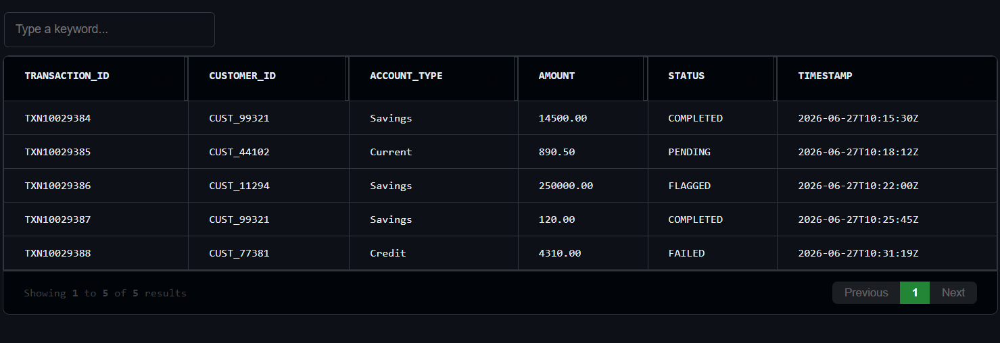

# DAT File Viewer

A high-performance, minimalist Visual Studio Code extension to preview, analyze, and inspect large delimited `.dat` files right inside your editor workspace.

Developed specifically for data engineering pipelines, production support analytics, and financial system data dumps.

---

##  Features

- **Multi-Delimiter Auto-Detection:** Automatically scans and detects `SOH` (ASCII 1 control character), Pipes (`|`), Commas (`,`), and Tabs (`\t`).
- **High-Volume Data Handling:** Powered by virtualized layout boundaries to load thousands of data rows fluidly without dropping editor frames.
- **Dynamic Interactive Data Table:** Built-in column resizing, text searching, and instant column sorting (ascending/descending) for immediate troubleshooting.
- **VS Code Theme Adaptive:** Automatically syncs text, backgrounds, and highlighting styles with your active editor theme (Light, Dark, or High Contrast).

---

##  How to Use It

1. Right-click any `.dat` file in your VS Code Explorer sidebar.
2. Select **Open With...** from the context menu.
3. Choose **DAT Tabular Viewer** from the dropdown list.
4. Use the global search box at the top right of the viewport to instantly filter log records, transaction IDs, or customer profiles.

---

##  Tech Stack & Architecture

- **Core Engine:** VS Code Extension API (`CustomTextEditorProvider`)
- **Frontend Layer:** Secure Webview Panel using VS Code native workbench CSS variables
- **Grid Engine:** Grid.js (lightweight virtual pagination)